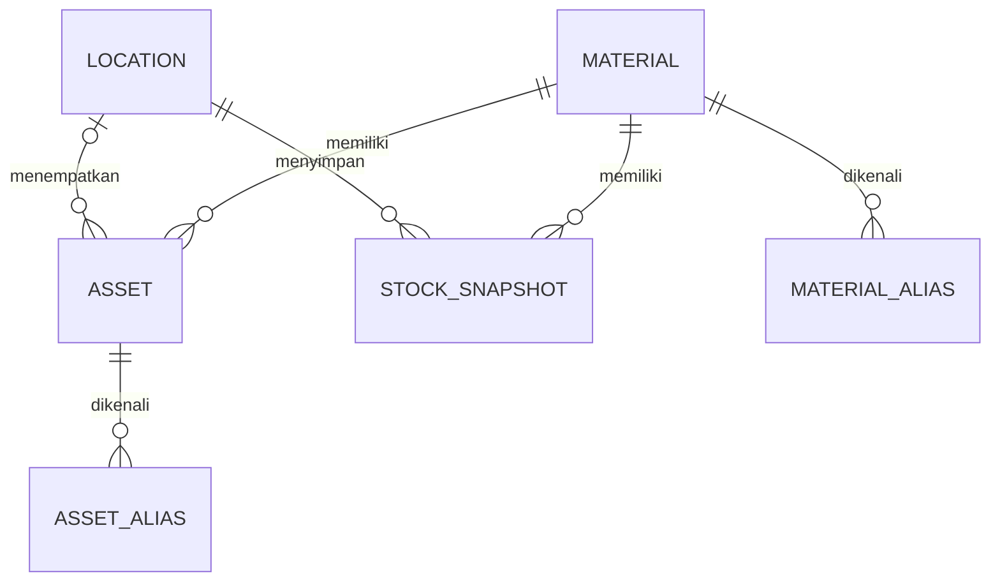
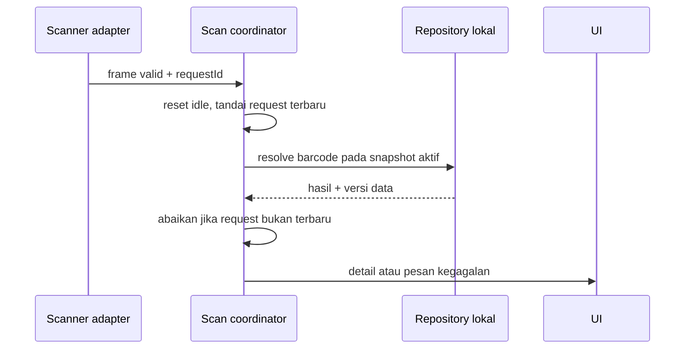

# Desain Pelaksanaan Universal-KIOSK

Status: desain kerja usulan untuk review; pilihan runtime final menunggu percobaan Windows. [Kebutuhan](requirements.md) dan [PLAN](../../PLAN.md) menjadi acuan.

## Keputusan kerja

Frontend usulan React + TypeScript + Vite, profil visual kuning mengikuti PLAN §6.1. Runtime kandidat pertama Tauri + SQLite. M1 harus membuktikan alur offline, scanner, instalasi dan akses petugas sebelum produksi bergantung pada adapter native. Alternatif Edge + layanan lokal hanya dipilih melalui catatan keputusan yang mencakup boot layanan, penyimpanan, otorisasi dan penguncian OS.

Kemiripan Universal-POS adalah kebutuhan visual dan interaksi, bukan mandat mengganti frontend menjadi Flutter. Versi dependency dipilih dan dikunci saat setup setelah memeriksa dokumentasi resmi serta kompatibilitas target; tidak ada versi yang diklaim sudah dipasang.

Struktur berikut merupakan target baru, belum berkas implementasi yang tersedia:

```text
src/
  app/                 komposisi, navigasi, konfigurasi dan state idle
  shared/ui/           token kuning, tombol, kartu, field dan dialog
  features/catalog/    pencarian, kategori, detail
  features/scanner/    frame input, lookup dan hasil terbaru
  features/programs/   program kerja dan konten informasi
  features/idle/       playlist dan peringatan timeout
  features/admin/      autentikasi petugas, impor, pengaturan dan diagnostik
  domain/              kontrak data dan aturan validasi
  ports/               antarmuka data, scanner, media dan administrasi
  adapters/            adapter produksi serta simulasi pengembangan
src-tauri/             hanya bila kandidat Tauri diterima
tests/                 tes domain, integrasi dan alur pengguna
docs/                  panduan operator, instalasi, pemulihan dan keputusan
```

Satu modul mengakses modul lain melalui antarmuka publik; detail native tidak diimpor ke komponen UI. Penyimpanan produksi berada pada direktori data aplikasi yang dapat ditulis akun yang tepat, terpisah dari berkas instalasi. Jangan menaruh rahasia pada bundle frontend.

## Kontrak data

| DTO | Field inti dan aturan |
| --- | --- |
| Category | id:string unik, name:string, sortOrder:number, active:boolean; kategori yang dirujuk material wajib ada tepat satu kali |
| Material | id:string, code:string, sapCode:string/null, name:string, categoryId:string, unit:string, specification:string/null, photoPath:string/null |
| Asset | id:string, materialId:string, serialNumber:string, locationId:string/null; hanya dipakai jika sumber memiliki identitas per unit |
| BarcodeAlias | value:string unik, targetType:material/asset, targetId:string; trim terminator transport, jangan ubah nol awal atau kapitalisasi isi tanpa kontrak sumber |
| Location | id:string, warehouseCode:string, zone:string/null, rack:string/null, bin:string/null |
| StockSnapshot | materialId, locationId, quantity:number/null, reserved:number/null, available:number/null, sourceAt:timestamp; field stok dari sumber, presisi desimal mengikuti satuan |
| ContentItem | id, title, type:image/video/text, localPath:null/string, text:null/string, order:number, validFrom:null/timestamp, validUntil:null/timestamp |
| ImportManifest | schemaVersion, datasetVersion, sourceName, sourceAt, fileList berisi path/size/hash; importedAt diisi aplikasi saat aktivasi |
| KioskConfig | organizationName, warehouseCode, timezone:string IANA, idleSeconds, warningSeconds, staleAfterHours:null/number, orientation:auto/portrait/landscape |

Jika staleAfterHours belum ditetapkan, UI menyebut kebijakan umur data belum dikonfigurasi dan tetap menampilkan waktu sumber. Timestamp memakai ISO 8601 dengan zona; tampilan mengikuti zona gudang yang dikonfigurasi. Angka non-finite ditolak; quantity null tidak menjadi nol. Nilai stok negatif ditangani sesuai kontrak sumber yang diputuskan M0, tidak dibetulkan diam-diam.



MATERIAL_ALIAS dan ASSET_ALIAS pada diagram adalah dua jenis tujuan dari BarcodeAlias. Validasi alias mencakup keunikan lintas keduanya. Implementasi SQLite harus menjamin referensi dan satu tujuan valid, melalui tabel terpisah/indeks alias bersama atau model ekuivalen yang diuji. `timezone` harus berupa zona IANA yang didukung runtime; nilai tidak dikenal ditolak.

## Antarmuka operasi

- MaterialRepository.search(query, categoryId, cursor) mengembalikan page dan cursor; detail(materialId) memuat saldo per lokasi beserta versi snapshot.
- ScanResolver.resolve(rawCode) mengembalikan found/notFound/invalid/unavailable beserta tipe tujuan; requestId memastikan hasil terbaru menang.
- ImportService.validate(source) mengembalikan errors, warnings dan preview; activate(validatedPackageId) mengaktifkan paket yang sama setelah pemeriksaan ulang; restore(snapshotId) memulihkan paket valid.
- AdminSession menyediakan autentikasi lokal, kedaluwarsa sesi, dan pemeriksaan izin di sisi native/layanan. Metode provisioning serta penyimpanan verifier ditentukan M1; tidak memakai PIN hardcoded atau secret frontend.
- MediaRepository hanya menyajikan berkas lokal dari paket valid. Path traversal, referensi absolut di luar paket, symlink keluar dan jenis media yang tidak diizinkan ditolak.

## Alur scan dan fokus



M1 menentukan transport scanner: utamakan prefix/suffix atau identifikasi perangkat yang terbukti. Jeda antarkarakter hanya bantuan, bukan pembeda tunggal. Jika HID tanpa framing tidak bisa dibedakan dari ketikan, dokumentasikan batasnya dan gunakan mode scan khusus dengan input pencarian terlindungi; perilaku scan global R06 perlu disesuaikan secara eksplisit sebelum dinyatakan terpenuhi. Buffer memiliki panjang maksimum dan timeout yang diukur dari scanner; modifier/control tidak menjadi data.

## Aktivasi data dan pemulihan

Impor menyalin paket ke staging terpisah, memvalidasi manifest, hash, data dan seluruh media, lalu membangun snapshot lengkap. Paket aktif dengan versi dan hash sama menjadi no-op. Paket lebih lama atau `sourceAt` mundur ditolak lewat impor normal; versi sama dengan hash berbeda ditolak. Paket lama yang sengaja dipakai harus melalui restore petugas dengan preview, konfirmasi, `sourceAt`/`importedAt` asli dan `restoredAt` baru. Operasi baca dipasangkan dengan versi snapshot agar detail dan stok konsisten. Aktivasi mengubah penunjuk snapshot aktif secara atomik menggunakan mekanisme yang dibuktikan pada runtime pilihan. Snapshot lama tetap tersedia; crash sebelum aktivasi tetap memakai versi lama, crash setelah aktivasi memuat versi baru yang lengkap. Hindari menganggap transaksi SQLite juga otomatis mentransaksikan berkas media.

Pengguna publik tidak dapat mengaktifkan paket. Masa sesi petugas yang habis memblokir operasi baru; operasi aktivasi yang sudah dimulai mencapai commit atau rollback terkontrol. Impor belum diaktivasi tidak dilanjutkan diam-diam setelah restart. Retensi dan pembersihan permanen mengikuti kebijakan yang disetujui Owner.

## State UI dan operasi

State publik: boot → setupRequired atau idle → home/programs/catalog/scan → detail/notFound/error. Sentuh dan frame scan valid mereset idle; background playback tidak. Saat peringatan timeout, tombol Lanjutkan mempertahankan halaman. Sesi publik berikutnya tidak mewarisi kueri atau detail pengguna sebelumnya.

Landscape memakai sidebar serta area katalog/detail bila muat; portrait mempertahankan urutan header, pencarian, filter dan grid, lalu detail tersendiri. Breakpoint berdasarkan ruang efektif setelah scaling, bukan resolusi fisik saja. Bandingkan 1920×1080 dan 1080×1920 dengan referensi Universal-POS. Token warna dan kontras sudah tercatat pada PLAN; render aktual tetap diuji.

Log lokal memuat waktu, versi aplikasi/dataset, jenis operasi, durasi dan kode error; hindari menyimpan kredensial atau isi barcode secara default. Tentukan batas ukuran log pada M1. Diagnostik membedakan kesiapan handler dari koneksi scanner fisik.

## Verifikasi desain sebelum kode produksi

Periksa R01–R15 terpetakan ke tugas, keputusan runtime/scanner/admin memiliki bukti, dan prototipe tidak bergantung pada data rekaan tanpa label. Skill SDD mensyaratkan requirements dan design diverifikasi serta disetujui sebelum implementasi. Permintaan Owner saat ini mengesahkan penyusunan rencana; ketika Owner memerintahkan pelaksanaan berdasarkan paket ini, gunakan instruksi tersebut sebagai persetujuan dalam lingkupnya tanpa meminta ulang secara rutin. Perubahan scope atau safety gate tetap mengikuti aturan workspace.
