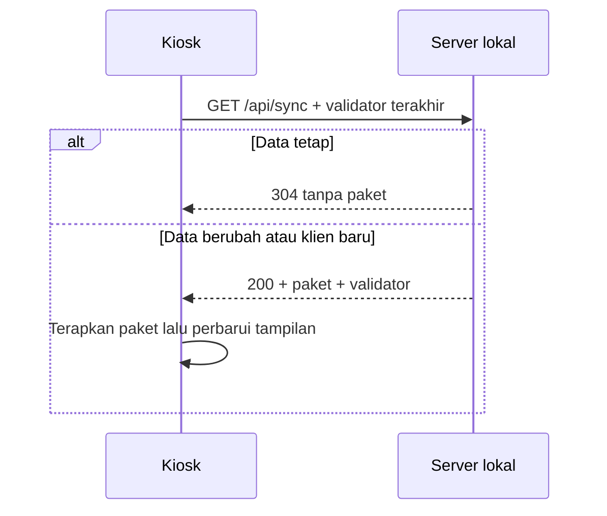

# Desain optimasi

Desain diperiksa terhadap kode saat ini dan batas visual yang disetujui Owner. Kontrak data publik tetap menggunakan ImportPackage, KioskConfig, dan ServerSyncPayload.

1. Katalog: indeks relasi berdasarkan ID, dengan umur cache mengikuti paket/array sumber. Pertahankan semantik hasil, termasuk urutan kecocokan scanner. Hindari cache hasil turunan yang membuat umur stok atau pembaruan data kedaluwarsa. Stabilkan props kartu bila aman tanpa perubahan markup/CSS.
2. SOP: pindahkan pembaruan progress per-frame ke elemen progress melalui ref. Pertahankan width, shimmer, transisi, dan bayangan yang sudah ada untuk kesetaraan visual. React hanya menangani tindakan pengguna dan pergantian langkah. Bersihkan timer/rAF/audio milik komponen saat dilepas.
3. Sinkronisasi: validator HTTP/304 pada server Node dan PowerShell, serta klien yang tetap menerima server tanpa ETag. Validator baru diakui setelah payload berhasil dibaca/diterapkan. Pisahkan cleanup subscriber polling dari subscriber lain dan abaikan respons sesi lama.
4. Verifikasi: uji semantik katalog, lifecycle animasi/polling, seluruh regresi, build produksi, dan pembandingan browser baseline/kandidat jika runtime tersedia. Rekam pengukuran lokal beserta batas lingkungannya.

Kegagalan jaringan/JSON tidak menghapus data lokal dan tidak mengunci validator yang belum diterapkan. Optimasi tidak memigrasikan penyimpanan persisten pada perubahan ini, sehingga data offline dan snapshot yang ada tetap dapat digunakan.
