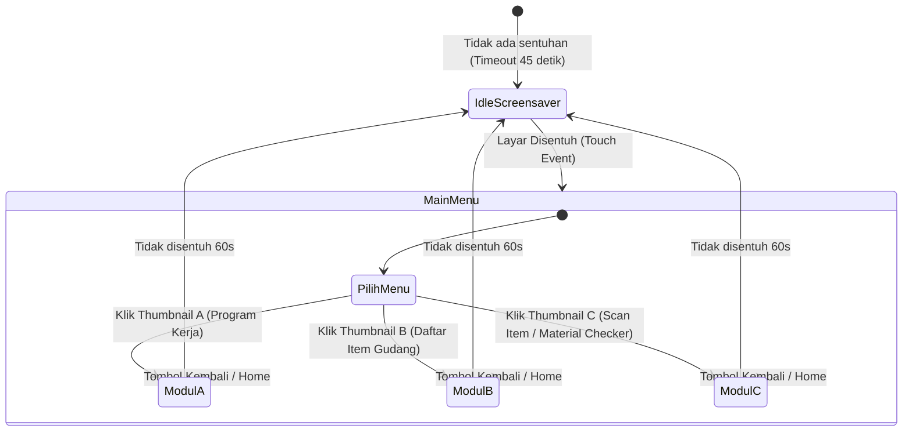

# ⚡ DOKUMEN SPESIFIKASI & RANCANGAN SISTEM
# KIOSK INFORMASI & SCANNER INVENTARIS GUDANG PLN
### Perangkat Target: Kassen WK-215 Self-Service Kiosk (Windows 10/11)

---

## 📌 1. Ringkasan Eksekutif & Tujuan Proyek

Sistem ini adalah aplikasi kios informasi interaktif dan pemindai inventaris mandiri (*self-service information & price/item checker*) yang ditempatkan di area Gudang Logistik PLN. Aplikasi berjalan di atas terminal **Kassen WK-215** yang dilengkapi layar sentuh 21.5 inci Full HD, pemindai 2D barcode/QR terintegrasi, dan printer thermal 80mm.

### Tujuan Utama:
1. **Media Informasi Dinamis (Idle Mode):** Menampilkan video profil, kampanye K3 (Keselamatan dan Kesehatan Kerja), dan dokumentasi program kerja saat kios sedang tidak digunakan.
2. **Edukasi & Transparansi Program Kerja (Thumbnail A):** Memudahkan petugas, tamu, dan manajemen melihat roadmap serta capaian program logistik gudang.
3. **Katalog Material Digital (Thumbnail B):** Menyediakan direktori pencarian cepat untuk seluruh material kelistrikan (MDU & Non-MDU) tanpa harus membuka sistem ERP/SAP di PC kantor.
4. **Cek Spesifikasi & Lokasi Material Mandiri (Thumbnail C):** Berfungsi layaknya *price checker* di supermarket, petugas lapangan cukup men-scan barcode/QR pada fisik material untuk langsung melihat detail nama, spesifikasi SPLN, stok, dan posisi rak/bin di gudang.

---

## 🖥️ 2. Spesifikasi Hardware Kassen WK-215 & Pemetaan Periferal

| Komponen Hardware | Spesifikasi Kassen WK-215 | Peran & Integrasi di Aplikasi |
| :--- | :--- | :--- |
| **Sistem Operasi** | Windows 10 / 11 64-bit | Platform runtime aplikasi kiosk |
| **Prosesor & RAM** | Intel Core i3, RAM 4 GB, SSD 64 GB | Memerlukan aplikasi ringan (*low footprint*, hemat memori) |
| **Layar Sentuh** | 21.5" Full HD (1080×1920 Portrait / 1920×1080 Landscape) | Touch target besar (min 56px), disable pinch-to-zoom & text select |
| **2D Barcode Scanner** | CMOS 2D Barcode & QR Reader (USB HID) | Mengirim data barcode sebagai keyboard input otomatis diakhiri `Enter` |
| **Thermal Printer** | 80mm Auto-Cutter (Built-in) | Mencetak bukti cek material / kartu lokasi rak / tiket info (opsional) |
| **Speaker Audio** | Built-in 3W Stereo | Efek suara "Beep" scanner, panduan suara "Silakan scan material Anda" |

---

## 🔄 3. Alur Pengguna (User Flow) & Logika State



---

## 🎨 4. Rincian Antarmuka & Fungsi Fitur

### 🎬 A. Mode Layar Diam (Screensaver / Attract Screen)
* **Kondisi Aktif:** Terpicu otomatis jika sistem mendeteksi tidak ada interaksi sentuhan selama **45 detik**.
* **Tampilan Konten:**
  * Carousel/Slideshow foto resolusi tinggi dan video berulang (*looping playback*):
    * Video Safety Induction & Budaya K3 PLN.
    * Galeri foto operasional dan penataan 5S gudang logistik.
    * Poster kampanye efisiensi & zero accident.
  * Ticker teks berjalan (*running text*) di bagian bawah: informasi pengumuman internal atau jam operasional gudang.
  * Overlay animasi berkedip lembut: *"Sentuh Layar untuk Memulai"* (*Tap anywhere to start*).
* **Interaksi:** Begitu layar disentuh di area mana saja, sistem langsung beralih mulus (*fade transition*) ke **Menu Utama**.

---

### 🏠 B. Menu Utama (Navigation Hub - 3 Thumbnail Interaktif)
Menampilkan sambutan formal: *"Selamat Datang di Terminal Layar Informasi & Scanner Mandiri Gudang PLN"*, dengan 3 kartu/thumbnail besar berorientasi sentuh:

1. **Thumbnail A: 📋 Program Kerja Gudang PLN**
   * Ikon/Ilustrasi: Papan rencana kerja & grafik logistik.
   * Deskripsi Singkat: *"Roadmap target, capaian logistik, jadwal audit, dan standar operasional 5S."*
2. **Thumbnail B: 📦 Daftar Item & Material Gudang**
   * Ikon/Ilustrasi: Rak gudang dan kotak inventaris kelistrikan.
   * Deskripsi Singkat: *"E-Katalog material distribusi, alat kerja, APD, dan pencarian stok gudang."*
3. **Thumbnail C: 🔍 Scan Item (Cek Spesifikasi Mandiri)**
   * Ikon/Ilustrasi: Scanner barcode aktif & sinar laser hijau.
   * Deskripsi Singkat: *"Dekatkan barcode/QR material ke scanner untuk melihat spek dan lokasi rak."*

---

### 📋 C. Modul A: Program Kerja Gudang PLN
* **Konten:**
  * **Tab 1: Visi, Misi & KPI Logistik:** Target zero-delay suplai material ke unit pelayanan teknik.
  * **Tab 2: Roadmap Program Tahunan:** Jadwal stock opname berkala, pemeliharaan material isolator/trafo, digitalisasi barcode.
  * **Tab 3: Penerapan 5S (Seiri, Seiton, Seiso, Seiketsu, Shitsuke):** Panduan visual tata kelola area gudang indoor & outdoor.
  * **Tab 4: Safety & K3:** Aturan wajib APD, jalur forklift, dan rambu evakuasi.
* **Fitur Navigasi:** Tombol *Next / Previous*, slider sentuh, dan tombol mencolok *"Kembali ke Beranda"*.

---

### 📦 D. Modul B: Daftar Item & Katalog Gudang PLN
* **Tampilan:** Grid kartu produk dengan foto, nama material, nomor normalisasi PLN/SAP, dan kategori.
* **Filter Kategori Cepat:**
  * ⚡ Material Distribusi Utama (Trafo, Kabel MVTIC/NYY, Tiang Beton).
  * 🔌 Perlengkapan Gardu & Jaringan (Isolator, Arrester, Fused Cut Out, NH Fuse).
  * 📟 Alat Pengukur & Pembatas (kWh Meter Pascabayar, Smart Meter AMI, MCB).
  * 🦺 Alat Pelindung Diri & Alat Kerja (Helm K3, Sarung Tangan 20kV, Grounding Set).
* **Fitur Pencarian:**
  * Tombol input dengan **On-Screen Virtual Keyboard** (QWERTY ramah sentuhan) sehingga pengguna bisa mengetik nama material tanpa keyboard fisik.
* **Modal Detail Item:**
  * Klik salah satu kartu material menampilkan pop-up detail lengkap (spesifikasi, standar SPLN, lokasi rak, stok).

---

### 🔍 E. Modul C: Cek Spesifikasi Mandiri (Scanner Item ala Minimarket)
Ini adalah fitur inti yang memaksimalkan hardware Kassen WK-215.

#### 1. Tampilan Siaga Scan (Standby Scanning Screen)
* Animasi visual ilustrasi scanner: *"Arahkan Barcode atau QR Code Material ke Kotak Pemindai di Bawah Layar"*.
* Status indikator scanner: **READY TO SCAN** (warna hijau menyala).
* Panduan audio otomatis berbunyi ramah: *"Silakan dekatkan barcode material ke scanner"*.

#### 2. Hasil Pemindaian (Item Specification Card)
Begitu barcode terdeteksi (data string masuk dari scanner USB HID), layar langsung beralih menampilkan informasi komprehensif:

```
+-------------------------------------------------------------------------------+
|  ⚡ HASIL PEMINDAIAN MATERIAL GUDANG PLN                                     |
+-------------------------------------------------------------------------------+
|  [ FOTO RESMI MATERIAL ]  |  NAMA MATERIAL:                                   |
|                           |  TRANSFORMATOR DISTRIBUSI 3 FASA 100 kVA         |
|   Ukuran HD               |  TEGANGAN 20 kV / 400 V - STEP DOWN               |
|                           |  ------------------------------------------------ |
|                           |  Kode Material / SAP : 100028471                  |
|                           |  No. Barcode         : PLN-TRF-100KVA-2026        |
|                           |  Standar Spesifikasi : SPLN D3.002-1:2007         |
|                           |  Merk / Pabrikan     : PT. Trafoindo Prima Perkasa|
|                           |  No. Seri Pabrik     : TR-2026-X89211             |
+---------------------------+---------------------------------------------------+
|  📍 LOKASI GUDANG:        |  Zona B (Heavy Material) - Jalur 2 - Blok H-04   |
|  📊 STATUS STOK:          |  Tersedia: 4 Unit | Terpola Proyek: 2 Unit        |
|  🛡️ STATUS UJI LAB:       |  PASS / Lolos Uji Laboratorium PLN Puslitbang     |
|  ⚠️ PETUNJUK PENANGANAN:  |  Wajib Forklift min 3 Ton, Hindari Benturan Keras |
+-------------------------------------------------------------------------------+
|  [ 🖨️ CETAK TIKET LOKASI ]              [ 🔄 SCAN MATERIAL LAIN ]             |
+-------------------------------------------------------------------------------+
```

* **Fitur Tambahan:**
  * **Cetak Tiket (Opsional):** Menekan tombol cetak akan mencetak struk ringkas ke printer thermal 80mm Kassen berisikan nama barang, lokasi rak, dan kode barcode untuk dibawa petugas lapangan ke lorong rak.
  * **Suara Notifikasi:** Bunyi "Beep" sukses dan suara *"Material berhasil ditemukan"*.
  * **Jika Barcode Tidak Terdaftar:** Tampilan peringatan ramah *"Material tidak ditemukan di database gudang. Hubungi Supervisor Logistik"*.

---

## 💻 5. Rekomendasi Arsitektur Perangkat Lunak

### Tech Stack yang Ideal untuk Spek Kassen (RAM 4GB):
1. **Frontend UI:** **Vite + React (TypeScript)** atau **Next.js Static Export**.
   * Sangat responsif, rendering animasi 60 FPS di layar sentuh.
   * Komponen UI berbasis Tailwind CSS dengan skala touch-friendly.
2. **Kiosk Wrapper / Local Runtime:**
   * **Pilihan 1 (Paling Ringan): Web Kiosk via Microsoft Edge / Chrome.**
     * Menjalankan browser Windows dalam mode Kiosk terkunci penuh tanpa title bar / address bar.
     * Konsumsi RAM sangat rendah (~120 MB).
   * **Pilihan 2: Tauri Desktop App.**
     * Menggunakan WebView2 bawaan Windows 10/11. Ukuran installer hanya ~10 MB dan RAM ~50 MB.
3. **Database Inventaris Lokal & Sinkronisasi:**
   * Menggunakan file `db-material.json` atau SQLite lokal di mesin Kassen.
   * Menyediakan endpoint REST API / Webhook background sync bila ingin dihubungkan ke server pusat PLN sewaktu ada koneksi internet/LAN.

---

## ⚙️ 6. Cara Kerja Input Scanner (Keyboard Wedge Handler)

Scanner bawaan Kassen WK-215 beroperasi dalam mode **USB HID Keyboard Wedge**. Scanner bertindak seperti keyboard berkecepatan tinggi:
1. Ketika barcode ditembak, scanner mengetik karakter barcode dalam rentang waktu sangat singkat (< 50ms).
2. Scanner mengirim karakter penutup `Enter` (`\n`).
3. **Logika Kode di Aplikasi:**
   ```typescript
   // Global listener untuk menangkap input scanner di semua halaman
   let barcodeBuffer = "";
   let lastKeystrokeTime = Date.now();

   window.addEventListener("keydown", (e) => {
     const currentTime = Date.now();
     
     // Scanner mengetik dengan jeda sangat cepat (< 50ms per karakter)
     if (currentTime - lastKeystrokeTime > 100) {
       barcodeBuffer = ""; // Reset jika input berasal dari ketikan tangan lambat
     }
     lastKeystrokeTime = currentTime;

     if (e.key === "Enter") {
       if (barcodeBuffer.trim().length > 3) {
         handleBarcodeScanned(barcodeBuffer.trim());
         barcodeBuffer = "";
       }
     } else if (e.key.length === 1) {
       barcodeBuffer += e.key;
     }
   });
   ```

---

## 🛡️ 7. Pengamanan Terminal Kiosk (Kiosk Lock-Down)

Untuk mencegah pengguna umum atau teknisi keluar ke desktop Windows atau merusak sistem:
1. **Nonaktifkan Context Menu (Klik Kanan):**
   `window.addEventListener('contextmenu', event => event.preventDefault());`
2. **Nonaktifkan Shortcut Berbahaya di Browser Kiosk:**
   Nonaktifkan `F11`, `F12` (Inspect Element), `Ctrl+R`, `Ctrl+N`, `Ctrl+W`, `Alt+F4`.
3. **Windows Auto-Start:**
   Aplikasi didaftarkan pada folder `shell:startup` Windows sehingga otomatis menyala saat mesin Kassen dihidupkan.
4. **Auto Reboot Bersih Tiap Subuh:**
   Jadwal Task Scheduler Windows untuk restart jam 03:00 pagi guna menyegarkan memori RAM 4GB.

---

## 🚀 8. Struktur Direktori Proyek Rekomendasi

```
kiosk-gudang-pln/
├── public/
│   ├── media/
│   │   ├── screensaver-videos/      # Video looping K3 & PLN
│   │   ├── screensaver-photos/      # Slide foto kegiatan
│   │   └── materials/               # Foto resmi produk/material
│   └── audio/
│       ├── beep.mp3                 # Suara scan sukses
│       └── welcome.mp3              # Panduan suara
├── src/
│   ├── components/
│   │   ├── Screensaver.tsx          # Mode diam (video/foto looping)
│   │   ├── MainHub.tsx              # 3 Thumbnail utama
│   │   ├── VirtualKeyboard.tsx      # Keyboard sentuh di layar
│   │   └── BarcodeListener.tsx      # Penangan scanner global
│   ├── modules/
│   │   ├── program-kerja/           # Modul Thumbnail A
│   │   ├── katalog-material/        # Modul Thumbnail B
│   │   └── price-checker/           # Modul Thumbnail C (Hasil Scan)
│   ├── data/
│   │   └── material-database.json   # Mock/Master data inventaris PLN
│   └── App.tsx
├── package.json
└── README.md
```

---
*Dokumen ini disusun untuk pengembang resmi develop-mikunitensai sebagai cetak biru teknis pembuatan Kiosk Mandiri Gudang PLN pada perangkat Kassen WK-215.*
